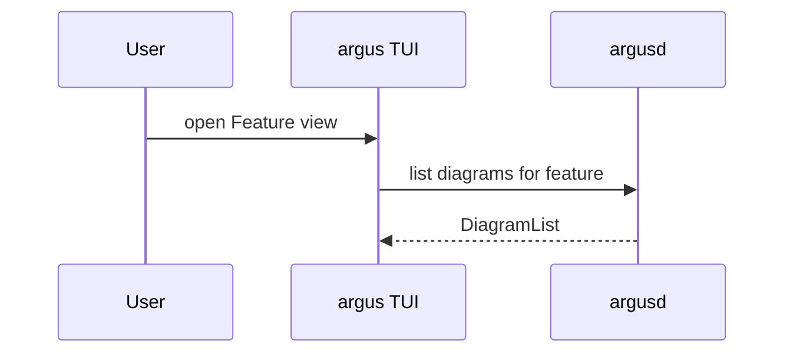

<!-- argus:managed-skill -->

# Sequence diagrams

Sequence diagrams belong to the selected feature (see [features.md](features.md)).
They record how parts of the system talk during one flow — client and daemon,
hook and store, user and TUI — without replacing decisions or tasks.

Argus stores **Mermaid** `sequenceDiagram` source on the feature. The TUI renders
it as Unicode box-drawing in a floating overlay; the list stays one line per
diagram in the Feature view **SEQUENCE** section.

## When to add one

Add a diagram when a later reader needs to see **order and direction**: who
calls whom, what gets pushed vs polled, and where a boundary sits. Prefer a
**decision** for why a shape was chosen, and a **task** for work left to do.
Do not diagram every function call or paste command output.

Good fits:

- A new protocol message or hook path and who sends it first
- A user gesture that opens an overlay and what the daemon returns
- A failure or retry path across two processes

Skip when a short decision `--because` or a task brief is enough.

## Writing the source

Use standard Mermaid sequence syntax. Start with `sequenceDiagram`, name
participants on their own lines, then messages:



Keep participants few and messages readable. Alt/opt blocks are fine when a
branch matters; avoid styling directives the TUI renderer may ignore.

## Helper commands

```sh
"$ARGUS_HOOK" diagram
"$ARGUS_HOOK" diagram add "open overlay from Feature view" --stdin
"$ARGUS_HOOK" diagram drop <id>
```

For `add`, put the full Mermaid source on standard input (heredoc or pipe).
Read the list first so you know existing ids before dropping one.

Do **not** append diagram source to the feature brief with `feature note`;
briefs stay prose.

## Humans in the TUI

In the **Feature** view (command center layout):

1. Select the feature the flow belongs to.
2. **Tab** to the **Diagrams** panel, or use the **SEQUENCE** block in the document.
3. **`a`** adds a starter diagram; **`Enter`** opens the selected row in an overlay.
4. **`j`/`k`** scroll inside the overlay; **`q`** or **Esc** closes it without
   removing the row.

Press **`r`** on the feature view if a diagram was added elsewhere and the list
has not refreshed.
